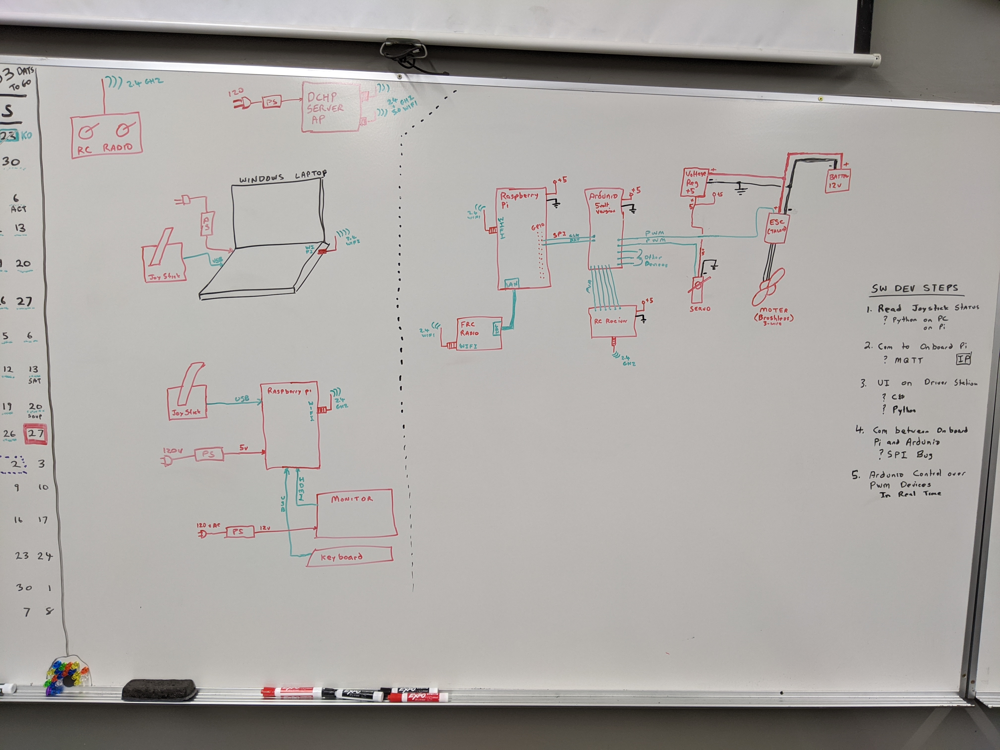

### New Water Robot Control System
**Jan 2021 EPIC Robotz**

This repository stores code that implements a control system based on a 
an onboard Raspberry PI (RPi) that communicates with a PC.  The PC contains
the Driver Station software.  The RPi also communicates with Arduino like
devices. 

This repository has three main folders: pc, rpi, and arduino -- each containing
code for their respective device.  

This code is freely shared to all team and subteams -- it is considered to be
a "reference" design that could be used to control a water bot, or any bot for
that matter.

Here is a pic of our starting block diagram.  (hopefully will improve as we move forward).

...

