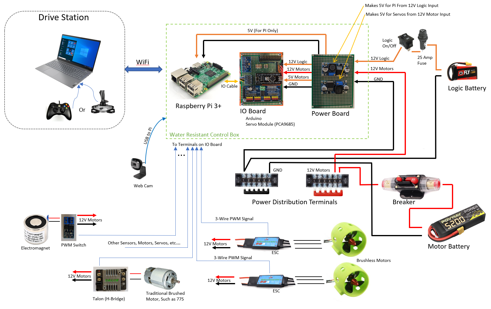
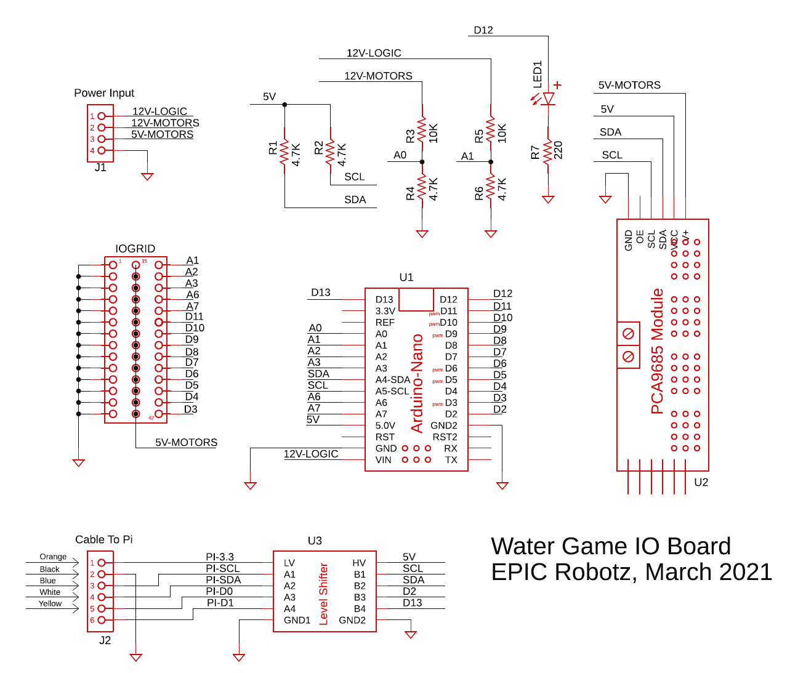
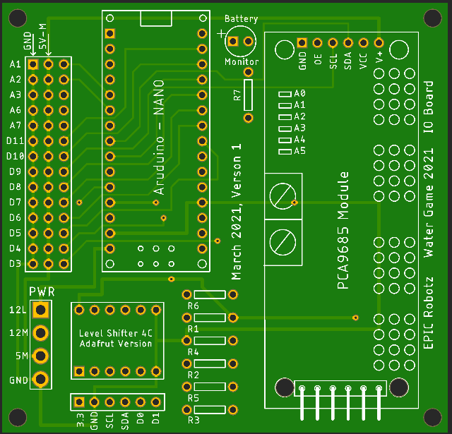

### Water Robot Control System
**Jan 2021 EPIC Robotz**

This repository stores code that implements a control system suitable for
the a land or water based robot.  The control system was invented for 
the Water Robot Challenge hosted by EPIC Robotz in March 2021.  

This control system provides Auto and Tele-Operated control to a tetherless robot
from a driver station hosted on a PC. The electronics on the robot consists of a
Raspberry Pi for overall management of the robot, and an IO board that provides
PWM and digital output, and sensor inputs from other electronic components on
the robot.

A block diagram of how such a Srobot could be wired up is shown below.  Also 
shown below is a schematic of the IO board that this control system uses.

Note that we have PCBs for the IO board, if you are interested.  (Also shown below.)

### Theory of Operation
The PC runs a python based program called the "driverstation".  This program
gather inputs from a joystick, gamepad, or both, and transmits these inputs to 
a python program running on the Raspberry Pi, called "runbot", which interperts the
inputs, and then commands the IO board to provide the proper PWM or digital IO
output to control the robot.  In addtion, the runbot program gathers sensor
data from the IO board and uses it to make decisions about the robot's operation.
Finally, the runbot program transmits sensor data back to the driverstation so
that the operator can monitor the conditions on the robot.

An MQTT broker runs on the Raspberry PI to provide communication between the
driver station and the Raspberry Pi.  

The driverstation program uses tkinter (a python package) to provide grapthic
that help show how the robot is running.  The driverstation also has a match
timer to aid the operator during a match.

The Raspberry Pi is configured as a WiFi Access Point (AP), so that the PC and the
robot can be on a priviate WiFi channel and a priviate TCP network can be created.

### About this Respository

Besides holding the code for the driverstation, Raspberry Pi, and the Arduino
that is embedded on the IO board, this repository has documentation on how
to set up the PC and the Raspberry Pi.  There are three main subdirectories:
one for the PC code, one for the Raspberry Pi code, and one for the Arduino code.
The documentation is spread throughout.

Best Wishes. 

### Block Diagram:

### IO Board Schematic:

### Prototype PCB for IO Board:

